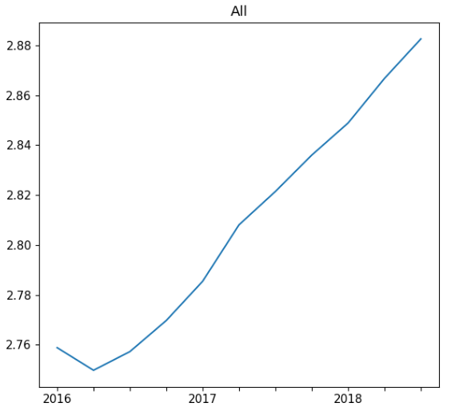
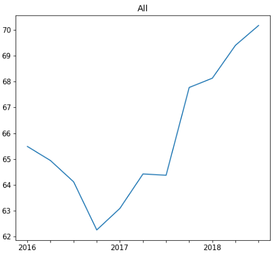
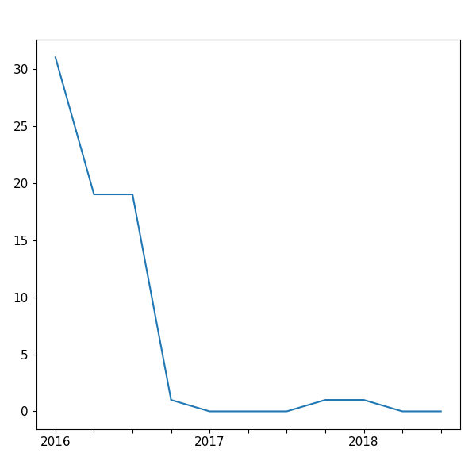
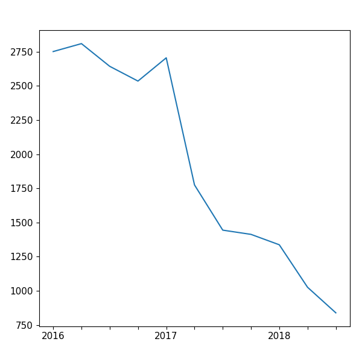

class: center,middle

# Ecosystem of package management systems

### By Wenhan Zhu (Cosmos)

???

History of package managers

First appeared in the early days of linux in the 90s.

Early to mid 2000s language specific packages began to move to own management systems due to requiring more features such as allow existing of multiple versions etc. 


Evolution:
left-pad situation on NPM

technical lag problem

Why interesting: evaluating code before use

Ant-design christmas easter egg


---

class: middle

## Layout

- Introduction to Package manager

- Literature Review on recent search on the topic

- Case study on Arch Linux

- Open research ideas on the topic

---

## Package Manager

### Introduction

First available in the early Linux days (early 90s)

*dpkg*, *rpm* still in use today!

### Major evolution

Mid 2000s the need for more features from language specific packages. *CPAN* was the first one, then *Maven* and many others.

System Distribution | Language 
------------ | -------- 
*zypper*, *pacman*, *apt*, *yum*, *dnf* | *Maven*, *PyPI*, *RubyGem*, *CRAN*, *NPM*, ...

???

Package manager is software tools that automates the process of dealing with software in a consistent manner.

With linux, distribution of binary vs source code.

More features:

- Multiple version of the same package

- Faster development release cycles of software (Update with system for distributions)
    Release updates like Debian, Ubuntu, etc.

Now it's the norm for a language to have it's own package manager.

---

## Package Manager

### Components

- Front end for users

- Repositories 

### Functionality

- Core
    - Install/Remove packages
    - Resolve dependencies
    - Update packages

- Optional
    - Compile/Build packages
    - Search
    - Multi-version management

???

Natural now, previously packages needs to be installed manually and upgrading is a great pain.

---

## Why is this topic interesting?

People want to maintain and improve software ecosystems however we do not understand much about them.

And some research has observed that some properties hard to generalize from ecosystem to ecosystem. [*Alexandre* et al.]

### Aspects

- Installability Issues in software repositories [*Abate* et al. *Claes* et al.]

- Evolution of dependency network [*Kikas* et al. *Wittern* et al.]

- Vulnerability [*Kikas* et al.]

---

## When things go wrong


???
`left-pad` incident short program extremely simple function but used by a lot of packages. Developer range quit due to `npm` removed his package by request of company for duplicate name of `kik`.

Current complexity of dependency network on `npm` makes it hard for developers to do code review before deployment of new package.


---

## *NPM*

*NPM* provides history snapshots of the repository and *JavaScript* is the most popular language as of recent years (current 2019).

### What we know about *NPM* and other ecosystems in common

- There are more packages and more updates as time goes on

- They experience exponential growth at first and slows down to linear afterwards (as of number of packages)

- The number of dependencies are increasing

### Things not in common

- How connected are the dependency networks

- Study on *PyPI* showed that packages are getting smaller in size, not true for *CRAN* which package size remains same through time. [*German* et al.]

???

*NPM* most studied as of now.

There are currently no detailed study on the cause of the connectiveness of dependency networks.

---

## Dependencies

```
A --> B --> C
```
If A depends on B and B depends on C.

- B is a dependency for A

- A is a dependent of B

- C is a transitive dependency for A

- A is a transitive dependent for C

But it's not always that simple...

---

## Dependency Hell

- Conflicting dependencies
    - Inner package 
    ```
    A -> B -> D(ver. 1.1)
    A -> C -> D(ver. 1.2)
    ```
    - General 
    ```
    A -> C (ver. 1.1)
    B -> C (ver. 1.2)
    ```
- Dependency cycle
```
A -> B
B -> C
C -> A
```

???

Minor, too many dependencies. (Only a problem if not using a package manager)

Other types, installed with different methods resulting incompatible local versions.


## Solutions

- versioning system

- package as whole (Many windows application does this)

- allow installation of multiple versions (Debian has as implementation of this)


---

## Case study on Arch Linux

### Why Arch

| | Monitored | Maintained|
| - | - | - | 
| Language | NPM, PyPI, Gem, Drupal, CRAN | OPAM
| Distribution | **Arch User Repository (AUR)** | Debian 

???

Separation of language specific package management system and distributions due to different behavior. New ideas merge back to distributions, *nix* package manager also for example.

**Monitored**: Any user could submit a package, community maintainter will only take action on special circumstances

**Maintained**: A package could not be submitted and/or updated until reviewed by community maintainers.

---
.left-column[
## Arch Repositories
]
.right-column[
### Official

2 separate SVN repositories that holds all packages in each. Have a git mirror.

- Core and Extra (Refer as Core from now on)

- Community

### Unofficial

Each package hosted on separate Git repos.

- Arch User Repository (AUR)
]
???
**Core** Holds essential packages for Arch Linux and the software that needs to build them, **Extra** for those important but does not classify as core such as x.org, python.

**Community** Holds popular packages from community. 

**Migration** If a package is popular in AUR and fits will be moved to community then in special cases moved to core.

---
.left-column[
## Arch Repository Structure

### Official
```
file
|__repos
|  |__architecture
|      |__PKGBUILD
|__trunk
   |__PKGBUILD
```

### AUR
Each git repo
```
file
|__PKGBUILD
|__.SRCINFO

```
]
.right-column[
### Port-like System
Build script that contains every information to build the software.

**PKGBUILD**: is a shell script containing the build information required by Arch Linux packages.

### Metadata for *PKGBUILD*
*.SRCINFO* extracted from *PKGBUILD*


### Structure of official
`repos/architecture/PKGBUILD` contains the code that builds the binary.

`trunk/PKGBUILD` is for development space.

]

???
Shell script could contain Malicious code.

Should always inspect, including AUR.

Arch officially only support x86-64

---
.left-column[
## Examples
]
### *PKGBUILD*
```
pkgname=glibc
pkgver=2.26
pkgrel=4
pkgdesc='GNU C Library'
arch=(i686 x86_64)
url='http://www.gnu.org/software/libc'
depends=('linux-api-headers>=4.10' tzdata filesystem)
makedepends=(git gd)
optdepends=('gd: for memusagestat')
...

.right-column[
```
### *.SRCINFO*
```
pkgbase = glibc
	pkgdesc = GNU C Library
	pkgver = 2.26
	pkgrel = 4
	arch = x86_64
	makedepends = git
	makedepends = gd
	depends = linux-api-headers>=4.10
	depends = tzdata
	depends = filesystem
	optdepends = gd: for memusagestat
	options = !strip
	options = staticlibs
...
pkgname = glibc

```
]
???
*pkgbase* meta information of single PKGBUILD file

Only *pkgname* is a package, defaults to *pkgbase* value.

---
.left-column[
## Cloning
]
.right-column[
### Official

Clone the git mirror of svn repositories. 

First commit:

- Core: 2008 Apr. 6

- Community: 2009 Jul. 16

### AUR
AUR hosts a list of all currently available packages. Used a tool `auracle` to clone each repo.

4000 API limits per IP per day

#### Problem

- Correctness of Tool

- No way of getting deleted packages


]
???

Reason for tool, package name does not necessarily match git repo name. Need to query AUR to get information about git repository.


AUR log contain information of deleted git repo package base name. Git url could be valid but not guaranteed.


AUR updated to current as of middle of 2015 used to be same as official. Every package was resubmitted. Archive of previous on github.

---
.left-column[
## Extract *.SRCINFO*
]
.right-column[
## Official
Does not contain *.SRCINFO* file. Created VM to run command to extract *.SRCINFO*.

Packages that does not generate *.SRCINFO* file or does not follow standard file structure are ignored. 

## AUR
Parse *.SRCINFO* file given. 

## Validation of parsed results
Compare with Arch official website
Followed Arch wiki for standard
]

???
**.SRCINFO** errors in official are sometime inconsistent with arch official website. However, followed arch wiki for guidelines as standard.

---
.left-column[
## Analysis
]
.right-column[
## Snapshots
Took snapshots by 3 months from 2016 Mar. to 2018 Sept.

## Dependency
Compute as directed graph. 

- \# of depends: Size of child of each node

- \# of transitive depends: Size of transitive enclosure of each node
]
---
.left-column[
## Analysis
]
.right-column[
### Installability

- Dependency missing

    ```
    A -> B

    B not in repository
    ```

Dependency cycle could happen in arch official repositories!

### Example
Cycle of dependency
```
freetype2 <--> harfbuzz
```


]

???

Will only focus on missing dependency

Real life reason and solution. Compile X with Y disabled then compile Y with X then compile X again with Y. (gcc)

---
.left-column[
## Results
]
.right-column[
### Average number of direct dependencies per package

]
---
.left-column[
## Results
]
.right-column[
### Average number of transitive dependencies per package

]
---
.left-column[
## Results
]
.right-column[
### Total number of uninstallable packages due to transitive dependency in Official repository

]
---
.left-column[
## Results
]
.right-column[
### Total number of uninstallable packages due to transitive dependency

]

---
## References

Mining component repositories for installability issues, *Pietro Abate* et al.

A Historical Analysis of Debian Package Incompatibilities, *Maelick Claes* et al.

Structure and Evolution of Package Dependency Networks, *Kikas* et al.

On the Topology of Package Dependency Networks, *Alexandre Decan* et al.

A Look at the Dynamics of the JavaScript Package Ecosystem, *Eric Wittern* et al.

The Evolution of the R Software Ecosystem, *German* et al.

---

class: center, middle

#Thank you!

.footnote[Slides powered by [Remark](https://remarkjs.com/#1)]


---
.left-column[
## Results
]
.right-column[

]
---
.left-column[
## Results
]
.right-column[

]
---
.left-column[
## Results
]
.right-column[

]
---
.left-column[
## Results
]
.right-column[

]
---
.left-column[
## Results
]
.right-column[

]
???
Mean is 0 for all

Mean for core is 2 (dir) 3~5 (trans) *not increasing*
---
.left-column[
## Results
]
.right-column[

]
---
.left-column[
## Results
]
.right-column[

]
???
Basically 0 for core packages

---
.left-column[
## Results
]
.right-column[

]


