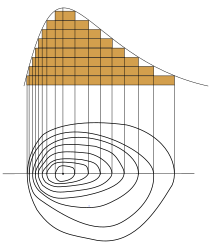
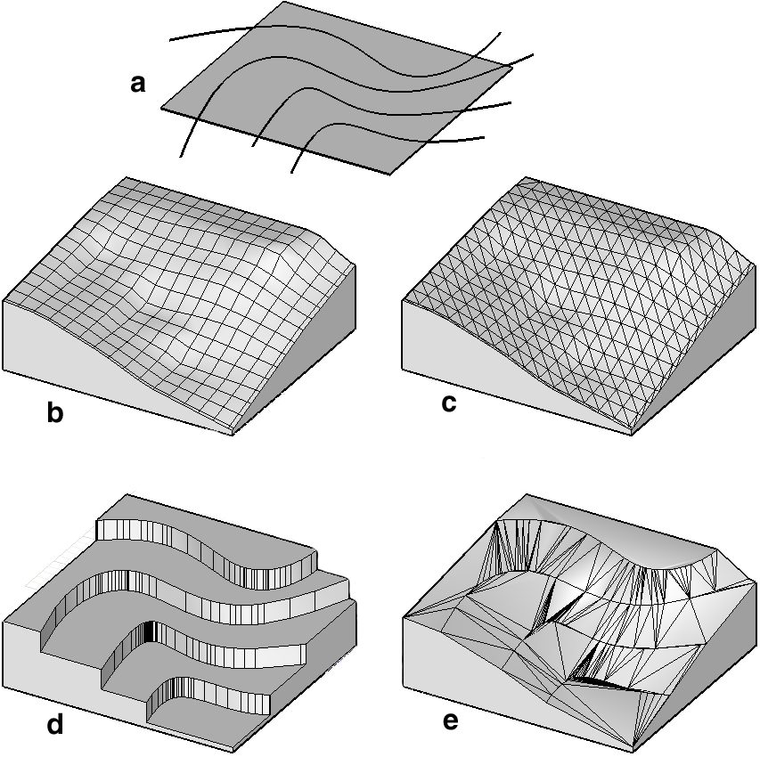
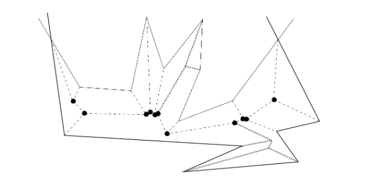
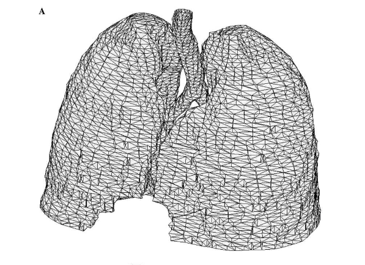
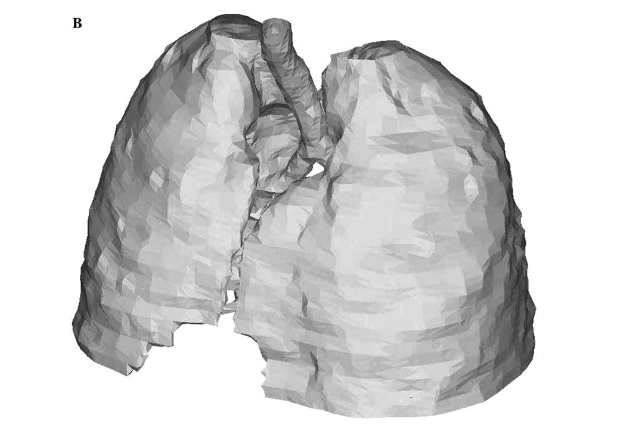

class: center, middle

# Coutour interpolation by straight skeletons

## By Gill Barequet, Michael T. Goodrich, Aya Levi-Steiner, Dvir Steiner

Presentation by: Wenhan Zhu (Cosmos)

---
.left-column[
  ## Definition
]
.right-column[

### Contour
A contour line (also isoline, isopleth, or isarithm) of a function of two variables is a curve along which the function has a constant value, so that the curve joins points of equal value. [* ]

  

]
.footnote[.red.bold[* ] Wikipedia: https://en.wikipedia.org/wiki/Contour_line]

---
.left-column[
  ## Problem
]
.right-column[

## Interpolate a piecewise-linear surface between two parallel slices, each consisting of an arbitrary number of polygons that define 'material' and 'non-material' regions.

]

---
class: center, middle

---
.left-column[
  ## Definition
]
.right-column[

### Monotone Polygon

A simple polygon is called monotone with respect to a line $l$ if for any line $l′$ perpendicular to $l$ the intersection of the polygon with $l′$ is connected. [* ]

]

.footnote[.red.bold[* ] Computational Geometry: Algorithms and Applications, pp. 55~58]

---
class: middle, center

---
class:middle, center

---
class:middle, center

---

class: middle, center
# Thank you!

.footnote[Slides created using [remark](https://github.com/gnab/remark)]
