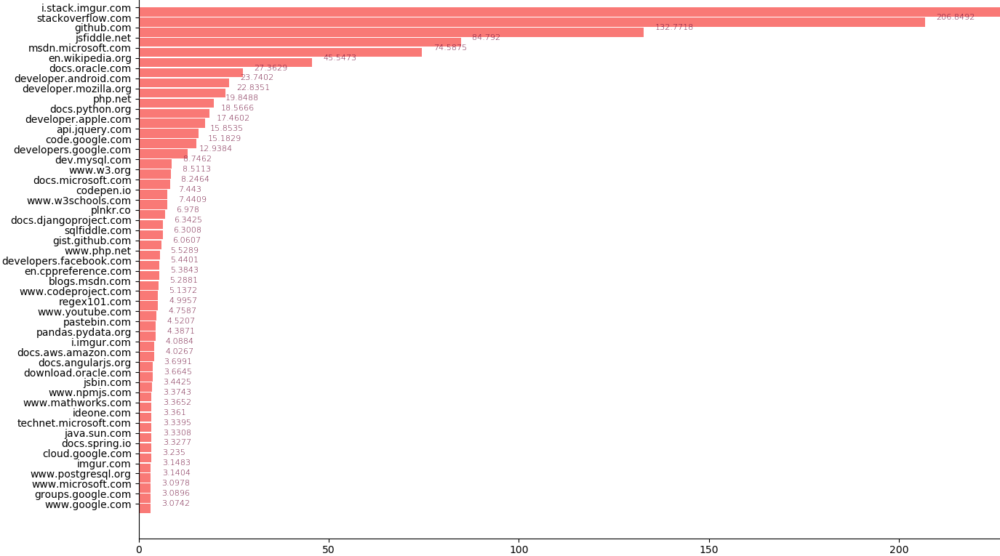
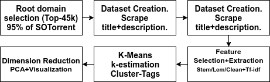
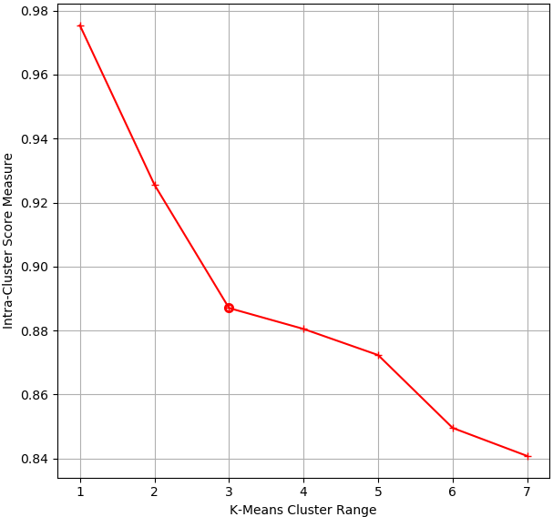
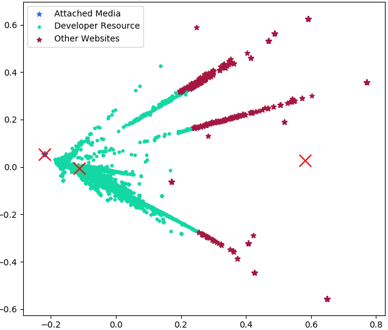
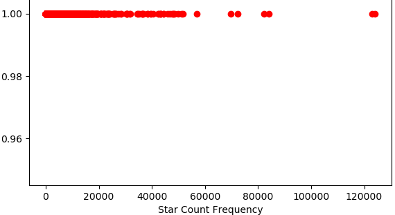
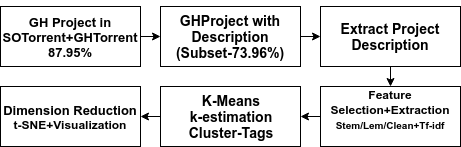
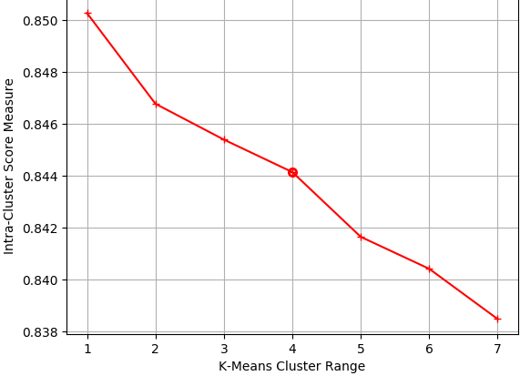
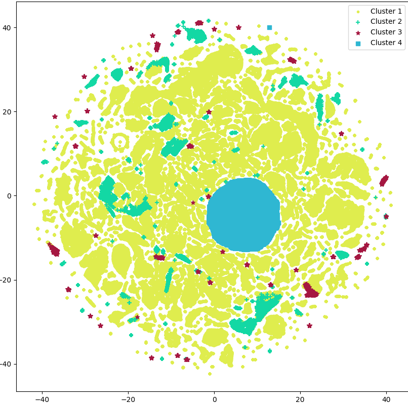

class: center,middle

## Studying the knowledge flow to *Stack Overflow* and from *Stack Overflow* to *GitHub*

### Presentation By Wenhan Zhu (Cosmos), Ankit Vadehra

---
# Introduction

Something

---
class: middle

### RQ1:
#### 1.1 Which external websites are used to provide information?

#### 1.2 What information is contained in those websites?

---

class: center, middle

The frequency of top 50 most used root level domains on Stack Overflowin 10k

---
class: middle

*Stack Overflow* (SO) outlink URL statistics

| **Link Category** | **Statistics** |
|:---|:---:|
|Total URLs in SOTorrent | 19,019,197 |
|Unique URLs in SOTorrent | 549,212 |
|Cleaned-Unique URLs | 544,530 | 
|URL's representing 95% of SOTorrent | 45,500 |
|URL's gathered out of 95% subset | 44,839 | 
|% of SO outlinks covered by scraped URLs | 94.62% |

---

class: center,middle
.left-seg[
Process to model the information in top referred SO outlink websites.

]
.right-seg[
K-means elbow estimation results to find best clusters for SO outlink websites

]
---

class: center, middle
.left-seg[
The 10 most important words for each URL clusters and the assigned label value

| **Top-10 Cluster Keywords** | **Cluster Label** | **URL in Cluster** |
| :-- | :-- | -- |
|'code', 'sourceforge', 'technology', 'tutorial', 'developer', 'tool', 'javascript', 'data', 'github', 'programming' | Developer Resource | 26,139 |
|'fix', 'site', 'hosting', 'source', 'codeplex', 'flowplayer', 'flexible', 'flowchart', 'flickr', 'archive' | Attached Media | 672
|'www', 'ca', 'edu', 'linux', 'blog', 'gov', 'article', 'info', 'project', 'uni' | Other Websites | 5350

]

.right-seg[
Visualizing the k-means clustering on SO outlink websites

]
---
class: middle
### RQ2:
#### 2.1 Is there a relation between a *GitHub* repository using *Stack Overflow* and its popularity?
#### 2.2 What are type of projects that utilize *Stack Overflow* code?

---
class: center, middle
.left-seg[
Statistics on GitHub(GH) Projects that refer StackOverflow(SO) posts

| **Category** | **Statistics** |
|:-- |:--:|
|GH code files that refer SO post | 6,111,157|
|GH users that have refered SO Posts | 305,205 |
|Unique GH projects that refer SO Posts | 436,664
|(Unique GH projects)-(forks) that refer SO Posts | 328,412
|GH projects found in both SOTorrent and GHtorrent | 384,035 |
|% of SOTorrent GH-projects in GHTorrent | 87.95% |
|GH projects in both SOTorrent and GHtorrent that have star/watch count | 137,712 | 
|% of SOTorrent GH-projects that have star/watch count in GHTorrent | $31.5% | 

]
.right-seg[
Star frequency for GH projects in both, SOTorrent and GHTorrent

]
---
class:center, middle
.left-seg[
Process to model the information in GH projects that refer SO posts.

]
.right-seg[
K-means elbow estimation results to find best clusters for GH projects.

]

---
class: center, middle
.left-seg[
The 10 most important words for each GH project clusters and the assigned label value

| **Top-10 Cluster Keywords** | **Cluster Label** | **GH proj in Cluster** |
|:-- | -- | -- |
|'project', 'app', 'libraries', 'code', 'source', 'framework', 'application', 'tool', 'python', 'js' | Cluster 1 | 262,731 | 
|'web', 'blog', 'app', 'framework', 'build', 'base', 'github', 'open','js', 'application', 'platform' | Cluster 2 | 17,517 | 
|'website', 'person', 'blog', 'portfolio', 'github', 'code', 'project', 'jekyl', 'web','repo' | Cluster 3 | 4770 |
|'code', 'file', 'simple', 'site', 'library', 'api', 'application', 'android', 'repository', 'python' | Cluster 4 | 37,939 |

]

.right-seg[
Visualizing the k-means clustering on GH projects

]

---

class: center, middle

#Thank you!

## Questions?

.footnote[Slides powered by [Remark](https://remarkjs.com/#1)]

