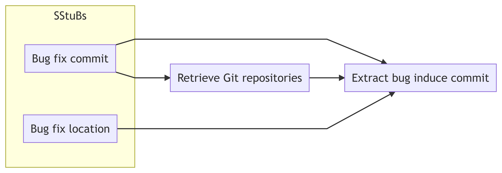
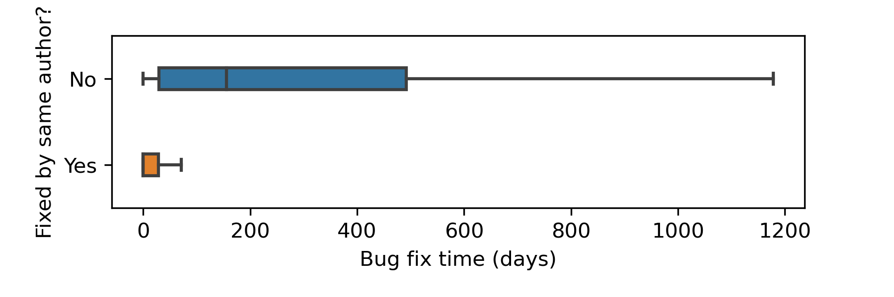
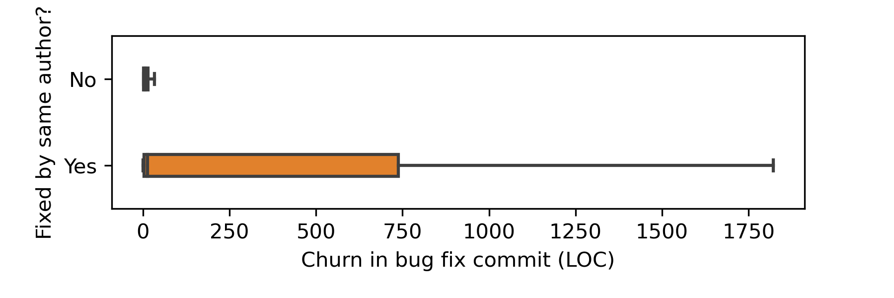

---
author:
- Wenhan Zhu, Michael W. Godfrey
title: Mea culpa How developers fix their own simple bugs differently from other developers
institute: University of Waterloo
linkstyle: bold
header-includes:
 - \usepackage[overlay,absolute]{textpos}
 - \usepackage{fvextra}
 - \DefineVerbatimEnvironment{Highlighting}{Verbatim}{breaklines,commandchars=\\\{\}}
output:
  beamer_presentation:
    keep_tex: true
    includes:
      in_header: preamble.tex
---

## Bug fixing in Open Source Software (OSS)

## Dataset collection

- 10,231 SStuBs from the top 100 Maven projects by popularity

## Adapting the SZZ algorithm to git

Integration (e.g., C6) vs Implementation (e.g., C4)

## Determine commit attributes

### Authorship 

The author information stored in a *Git* commit

### Bug fixing time

Time difference between bug induce and bug fix

### Commit size (i.e., Churn)

Sum of added and removed lines

## Developers fix their own simple bugs about half of the time

: Bug fixes by authorship

| Fixed by same author   | Fixed by a different author   | Total   |
| ---------------------: | ----------------------------: | ------: |
| 5,674                  | 4,508                         | 10,182  |

## Bug fixes by same author is fast and often within the same day

## Bug fixes by same author is larger in size and varies widely

## Patterns of bug fixing

::: columns

:::: column

### Same author simple bug fix

- Fixed quickly after introducing
- Often embedded in a larger commit

::::

:::: column

### Difference author simple bug fix

- Occur sometime after the bug in introduced
- The commit often does only fixes the bug

::::

:::

## Summary

\begin{textblock}{0}(0.2,3)
  \includegraphics[width=6.5cm,page=3]{presentation}
\end{textblock}
\begin{textblock}{0}(8.0,3)
  \includegraphics[width=6.5cm,page=7]{presentation}
\end{textblock}
\begin{textblock}{0}(0.2,9.3)
  \includegraphics[width=6.5cm,page=8]{presentation}
\end{textblock}
\begin{textblock}{0}(8.0,9.3)
  \includegraphics[width=6.5cm,page=9]{presentation}
\end{textblock}
