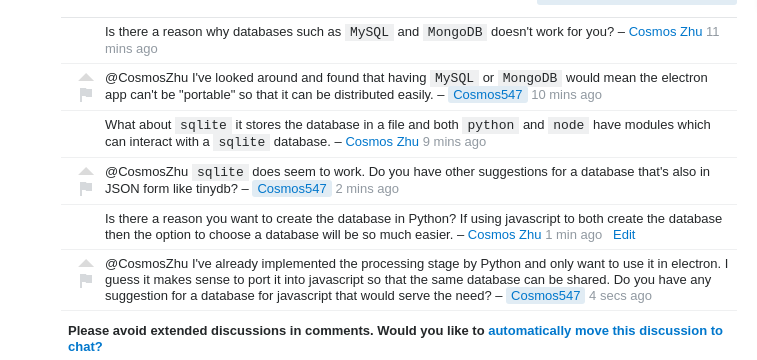

# Creation of chat room

After 3 back and forth comments between 2 users, a text under the comment thread will appear and give the option to automatically create a chat room. 

The chat room is then automatically created with all comments between the 2 users imported. 

And a comment is automatically sent in the comment thread. The option to create the chat room will disappear after the creation of chat room.

