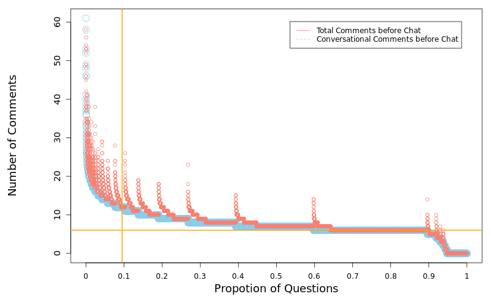
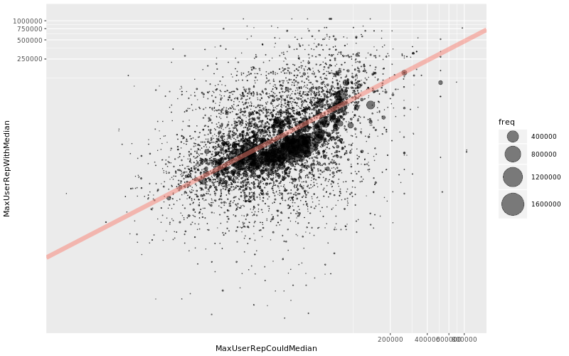
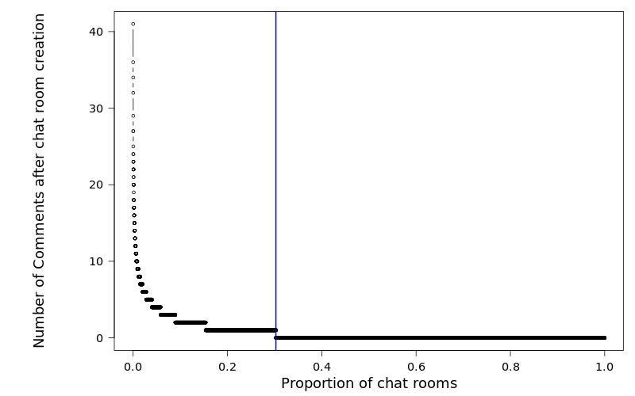
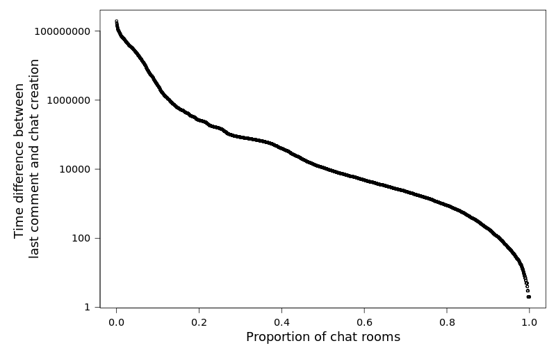

## Overview

- Communications for Developers
- Chat rooms mechanics on Stack Overflow
- Characteristics of Stack Overflow chat rooms
- Impact of chat rooms on Stack Overflow
- Extra bits

## Communication Channels

A communication channel is a method that developers find information or discuss with other developers.

e.g. E-mail, Mailing list, IRC, Slack, Stack Overflow, Documentation...

[//]: # (Developers on average use ~10 channels, Q&A and real-time messaging are essential to the channels)
[//]: # (Stack Overflow have both and its interesting to see how they interact with each other in design)

# What are chat rooms in Stack Overflow?

## Chat rooms FAQ


## Types of Chat Rooms


## How are question chat rooms created?


---


---

Begining of chat room

... Omitted messages...

End of chat room


## Data selection


[//]: # (Hidden comments due to the rule of chat room creation and because it's interesting since more people view them)

[//]: # (Explain why ~6k chat rooms do not have associated questions on Stack Overflow)

## Comments before creation of chat room


## Rounds of trigger


## 62.9% of chat rooms are created after two users in comments


## No difference between number of views between Question~WithChat~ and Question~CouldChat~

74.0% of sample test have p.value >= 0.05

## Question~WithChat~ have less users in comments before chat


## User reputation before creation of chat room

---------------------------------------------------------------------------------------------
                                  Question~WithChat~ Median        Question~CouldChat~ Median
--------------------------------- ------------------------- ---------------------------------
Max user reputation in comments                     8,636.5                            29,711 

Min user reputation in comments                         378                               166 

Asker Reputation of question                            457                               173 
---------------------------------------------------------------------------------------------

## Chat room usage differs across communities


## Trgger acceptence rate differs across communities


--- 
Largest communities on Stack Overflow tend to have larger difference between maximum user reputation in comments before creation of chat room



# What are the effects of chat rooms?

## 69.7% of the discussion migrates to chat room after its creation


## Distribution of time difference between time of last comment and chat room creation time


88.0% of comments are posted when the chat room is active


## Discussions finishes faster for Question~WithChat~


# Extras! Interesting bits


## Information shared in chat rooms
### External resources in chat rooms
- 51,800 messages contain at least one URL in 17,911 (68.13%) chat rooms

```{.center}
                domain freq
 1:  stackoverflow.com 9891
 2:         github.com 3852
 3:       jsfiddle.net 2838
 4:       pastebin.com 2115
 5:  i.stack.imgur.com 1912
 6:       gravatar.com 1594
 7:    gist.github.com  913
 8: msdn.microsoft.com  678
 9:          imgur.com  655
10:   en.wikipedia.org  598

```

## Information shared in chat rooms continued..

### Code segments in chat rooms
- 92,011 (6.11%) of messages contain code segments in 18,756 (71.35%) of chat rooms

### Beyond the chat room conversation
- 6,580 messages in 2,440 (9.28%) chat rooms mentioned "e mail", "e-mail" or "email"
- 2,428 messages contains an email address in 1,578 (6.00%) chat rooms

# Thank you!
