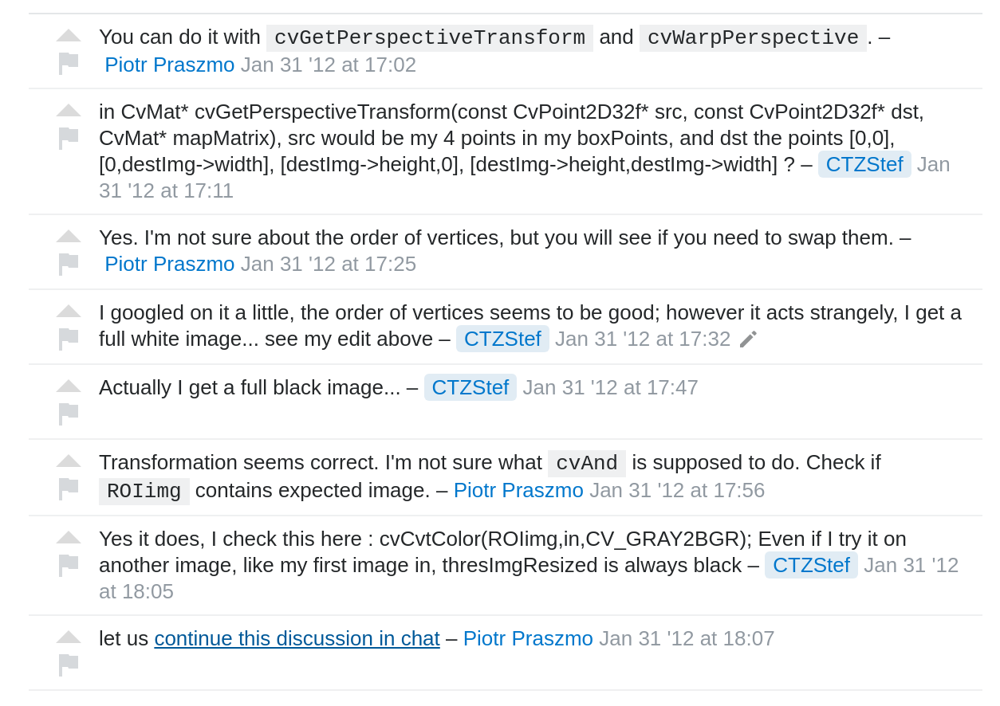

# What are chat rooms in Stack Overflow?

## Chat rooms FAQ

## Types of Chat Rooms

## How are question chat rooms created?

---
Begining of chat room

... Omitted messages...

End of chat room

## Rounds of trigger

# Thank you!
