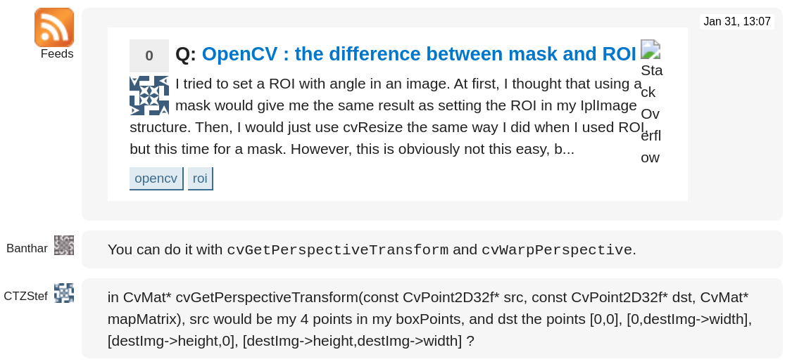
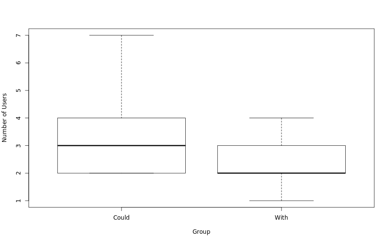
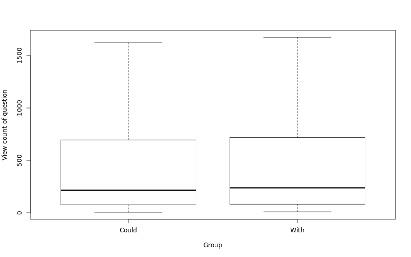
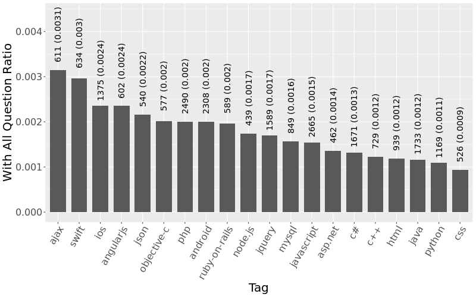
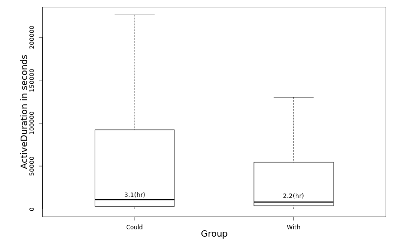

# What are chat rooms in Stack Overflow?

## Chat rooms FAQ

## Types of Chat Rooms

## How are question chat rooms created?

---

Begining of chat room

... Omitted messages...

End of chat room

## Data selection

[//]: # (Hidden comments due to the rule of chat room creation and because it's interesting since more people view them)

[//]: # (Explain why ~6k chat rooms do not have associated questions on Stack Overflow)

## Rounds of trigger

## 62.9% of chat rooms are created after two users in comments

## Question~WithChat~ have less users in comments before chat

## No difference between number of views between Question~WithChat~ and Question~CouldChat~

74.0% of sample test have p.value >= 0.05

## Chat room usage differs across communities

## Trgger acceptence rate differs across communities

# What are the effects of chat rooms?

## Discussions finishes faster with chat rooms

# Thank you!
