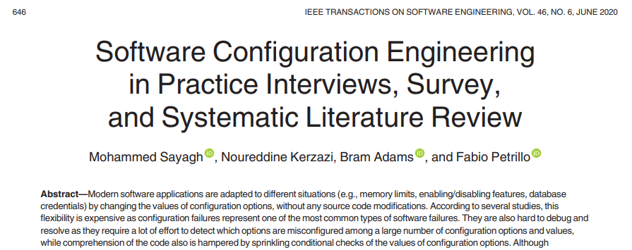
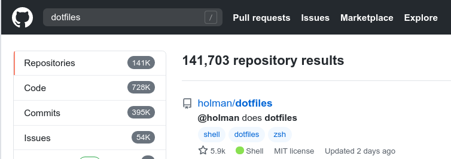
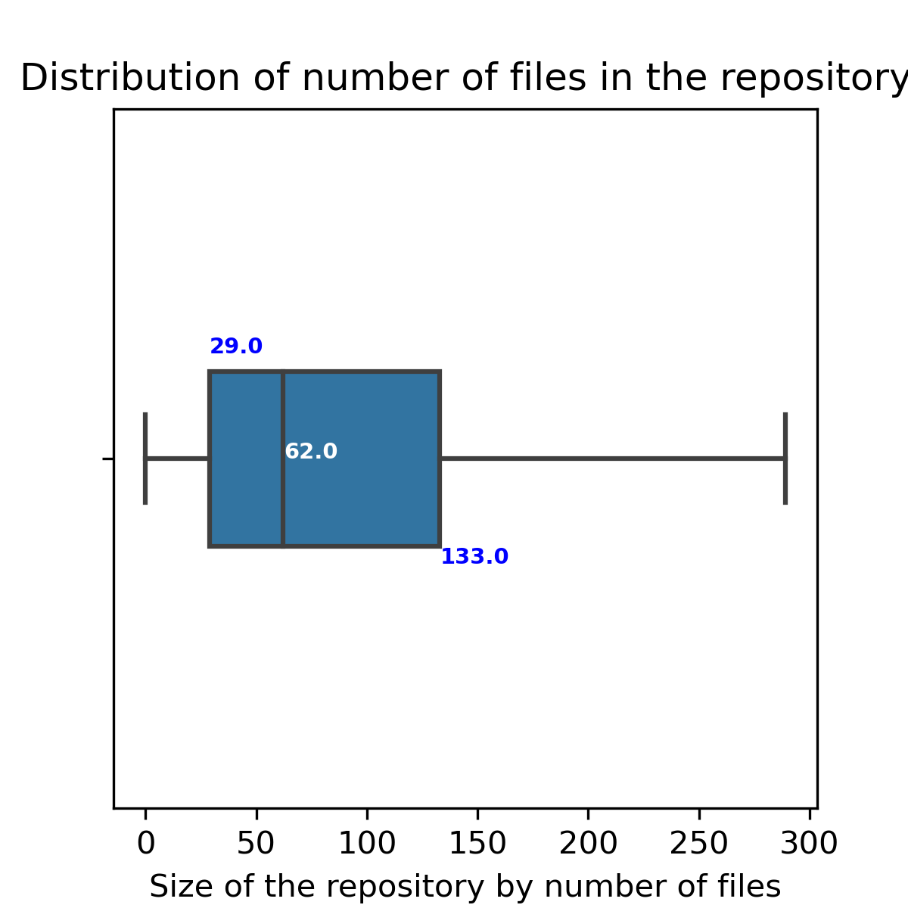
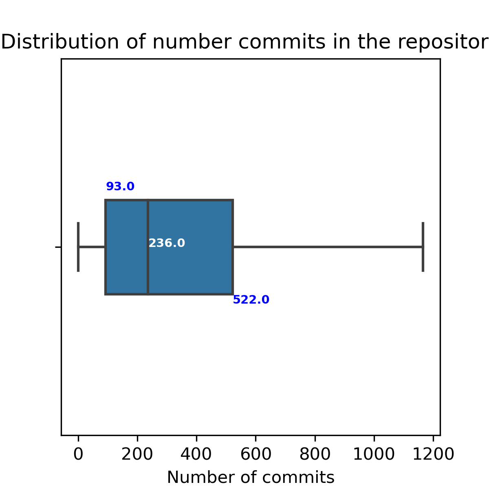

# Definition of *dotfiles*

> User-specific application configuration is traditionally stored in so called
> **dotfiles** (files whose filename starts with a dot).
> --- ArchLinux Wiki [^1]

[^1]: https://wiki.archlinux.org/index.php/Dotfiles

# 

![Advocate for *dotfiles* sharing. [^2]](./dotfiles-are-meant-to-be-forked.png)

[^2]: https://zachholman.com/2010/08/dotfiles-are-meant-to-be-forked/

# 

![Dotfiles community on GitHub [^3]](./dotfiles-community-github.png)

[^3]: https://dotfiles.github.io/

#

# Improving user-space software development

**Improving code completion with program history** by *Romain Robbles and Michele
Lanza* ASE 2010

![Tabnine autocompletion [^4]](./tabnine-autocompletion.png)

[^4]: https://www.tabnine.com/blog/deep/

# Exploration on user *dotfiles* management

## Change in open source software community

### Previouly people would e-mail each other when they use your software

### Now more ways to communicate with developer such as gitter/slack/discord

### The silent majority

### Distributed helping (i.e., people would ask about how to use X on Stack Overflow/reddit and not neccessary the developer of the software) 

#

# Data collection

All GitHub repos matching extactly the name `dotfiles` with the following
criteria

- 5 stars
- 5 commits in the `dotfiles` repository
- 10 commits in other repositories

Result: **3305** total *dotfiles* repositories.

# Who hosts their *dotfiles* on GitHub?

#

: Owners of *dotfiles* repositories

-----------------------------------------------------------------------
Occupation                                                        Count
---------------------------------------------------------------- ------
Developers                                                          79

System Admin                                                         3

Students                                                             6

Researchers                                                          3

Unknown                                                              9

Total                                                              100
-----------------------------------------------------------------------

# What files are contained in *dotfiles* repositories

#

{height=300px}

#

{height=300px}

#

{height=300px}

#

{height=300px}

# Thank you! Any suggestions
