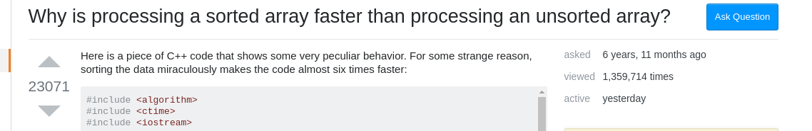

class: center,middle

# Literature Review Research on Stack Overflow

### By Wenhan Zhu (Cosmos)

---

class: middle

## Layout

- Stack Overflow Infrastructure

- Overview of Research using Stack Overflow

- Issues with Stack Overflow

---

### Stack Overflow

Question

Comment

Answer

???

Most upvoted question on SO

---
class: middle
## Research Interest on SO

### 2 MSR Challenges on the topic

- MSR 2015 (Official Data Dump)

- MSR 2019 (SOTorrent)

---
### Stack Overflow Infrastructure (Est. Jan. 2014)
.left-column[
### Posts

- Post Type
- Post History
- Post Status

### Comments

- Related Post
- User

### Users

- Id
- Action
]
.right-column[
Question

Comment

Answer

]

???
Answer and Question considered as posts

Can be edited by anyone

2 MSR challenges regarding SO
1 for official data dump
1 for SOTorrent, which added matching between code blocks

The infrastructure of Stack Overflow

---

class: middle, center

# Research on SO

### Study of SO the platform

### Taking advantage of SO knowledge 

---
.left-column[
## Studying SO
]
.right-column[
## Success of SO
### The Model

- Gamification

  - Voting

  - Reputation

  - Rewards
]

---
class: middle
## Studying SO

- Users

- Questions

- Answers

- Comments

???
Many study on users, questions. Less on answers and comments

---
.left-column[
## Studying SO
]
.right-column[
## Users

- Active GitHub committers ask fewer questions but answers more questions on Stack Overflow (Vasilesu et al.)

## Questions

Quality of question has been considered by the number of answers it receives.

- Highly Answered questions are empirically different than questions with no answers. (Jin et al.)

]
.footnote[
What Edits Are Done on Highly Answered Stack Overflow Questions? An Empirical Study by Jin et al.

Stack Overflow and GitHub: Associations Between Software Development and Crowdsourced Knowledge by Vasilescu at el. SocialCom 13'
]

???
SO questions has a mean of 2 answers.

---
.left-column[
## Studying SO
]
.right-column[
## Answers

- Fining good answers (Calefato et al.)

- Answers revision (Wang et al.)

## Comments

- Comments trigger updates to answers (Baltes et al.)

]
.footnote[
How Do Users Revise Answers on Technical Q&A Websites? A Case Study on Stack Overflow by Wang et al. TSE 18'

Mining Successful Answers in Stack Overflow by Calefato et al. MSR 15'

SOTorrent: Reconstructing and Analyzing the Evolution of Stack Overflow Posts. by Baltes et al.
]

???
Unlike questions, quality of answer is hard to measure. One way using accepted answers, however, accepted answer in studies showed that is not empirically different than other answers. 

Revise answers:
Collaborative editing does not lead to higher quality.
Badge awarding days encourages users to revise answers

---

.left-column[
## Studying SO
]
.right-column[
## Content

- API Coverage (by Parnin et al.

## SO code reuse

- Largely reused on GitHub (Yang et al. Baltes et al.)

- Often adapted to suit developer needs (Zhang et al.)

]

.footnote[

Crowd Documentation: Exploring the Coverage and the Dynamics of API Discussions on Stack Overflow by Parnin et al.

Stack Overflow in Github: Any Snippets There? by Yang et al. MSR 15'

Analyzing and Supporting Adaptation of Online Code Examples by Zhang et al. ICSE 19'
]
???

Stack Overflow in Github: Any Snippets There? by Yang et al. MSR 15'
In Python. Block and token hash then with SourcererCC, qualitative analysis on most common code clone.
Top 10 are some very common code snippets.

---

class: middle
## Using SO knowledge

- API 

- English Code translation

---
.left-column[
## Using SO knowledge
]
.right-column[
## API

- Better API suggestion (Treude et al.)

## English Code translation

- Generate code template from english words (Nguyen et al.)

]
.footnote[
Augmenting API Documentation with Insights from Stack Overflow by Treude et al. ICSE 16'

Statistical Translation of English Texts to API Code Templates by Nguyen et al. ICSME 18'

]
---

## Pitfalls

### Security

- Harmful code widely used in real world products. (Fischer et al.)

- Answers contains insecure code segments (Chen et al.)

.footnote[
Stack Overflow Considered Harmful? The Impact of Copy&Paste on Android Application Security by Fischer et al. ISSP 17'

How Reliable is the Crowdsourced Knowledge of Security Implementation by Chen et al. ICSE 19'

Are Code Examples on an Online Q&A Forum Reliable? A Study of API Misuse on Stack Overflow by Zhang et al. ICSE 18'
]

???
Android Application on security conference.

Existing database, qualitative examination by security experts. Results, can't differentiable just by looking at the post.

---

## Challenges

- API usage violation (Zhang et al.)

- Outdated Information (Ragkhitwetsagul et al. Zhang et al.)

- License Violation (Ragkhitwetsagul et al. Baltes et al.)

.footnote[
Toxic Code Snippets on Stack Overflow by Ragkhitwetsagul et al. TSE 18'

An Empirical Study of Obsolete Answers on Stack Overflow by Zhang et al. TSE 19'

Usage and attribution of Stack Overflow code snippets in GitHub projects
]

???
Answerers not aware of obsolete information, most of the time obsoleteness is supported by evidence.

SO license require acknowledgement, often not enforced and many people not aware.

---

class: center, middle

#Thank you!

.footnote[
Slides powered by [Remark](https://remarkjs.com/#1)
]
