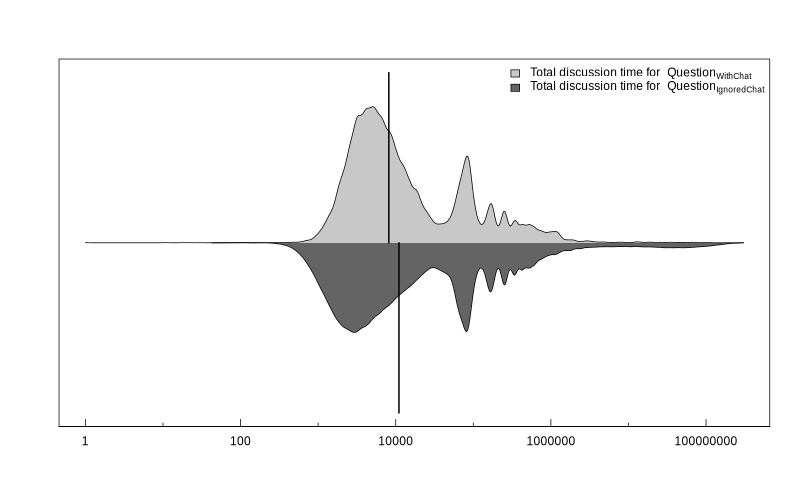

## Stack Overflow

Over 19 million questions and 29 million answers for programming problems. 

## Stack Overflow Mechanisms

## Stack Overflow Mechanisms continued...

## Question-answering process

~~~{.mermaid format=png theme=default}
graph LR;
    A["Question"] --> B["Answer"];
    A --> C["? Discussion"];
    C --> B;
~~~

## Discussions for questions

## Extended discussions leads to chat rooms

## Reverse engineering the chat rooms mechanism

> 3 back and forth comments between two users

## Dataset construction

## Research Questions

1. How prevalent are question chatted on Stack Overflow?
2. How do discussions migrate from commenting to chatting?
3. How does chatting affect question answering activities?

# How prevalent are question chatted on Stack Overflow?

## Discussions in comments

33.5 million comments and 1.4 million messages associated with Stack Overflow questions.

| Type of questions with comments      | percentage with discussions before answers   |
| ------------------------------------ | -------------------------------------------: |
| Questions with answers               | 75.4% of 8.2 million                         |
| Questions with accepted answers      | 80.0 of 3.9 million                          |

## Discussion in chat rooms

408,246 questions have enough conversational comments to trigger the option to create a chat room.

A chat room was not created for 91.3% of the questions.

| Type of questions with chat rooms   | percentage with discussions before answers |
| ----------------------------------- | -----------------------------------------: |
| Questions with answers              | 76.5% of 14,978                             |
| Questions with accepted answers     | 80.0% of 9,996                              |

# How do discussions migrate from commenting to chatting?

## Discussions move into chat rooms once they are created.

## Discussions in chat rooms are mainly between 2 users, and they have 3.6 times the amount of messages.

In 90.0% (i.e., 17,616) of chat rooms, two users participates in the chat room. 

{ width=75% }

## More than half (i.e., 55.2%) of chat rooms are not created immediately after the option is available.

{ width=90% }

## Reputation does not affect users' behavior related to chat room creation

{ width=90% }

# How does chatting affect question answering activities?

## After the trigger event/creation of chat room questions leveraging chat rooms are more likely to receive accepted answers.

44.5% (i.e., 7,634) of $Question_{WithChat}$ receives accepted answers after the creation of a chat room.

14.8% (i.e., 35,466) of $Question_{IgnoredChat}$ receives accepted answers after triggering the option to create a chat room.

## Chatting allow a more responsive environment for discussions and is dense in information

Users on average (median) respond to each other 5.2 times faster in messages compared to comments in the same question.

Messages are 4.7 times the density of comments on average (median) for the same question. 

## Creating chat rooms is associated with faster answers

::: columns

:::: column

::::

:::: column

::::

:::

## Leveraging chat rooms saves the total discussion time

# Implications and discussions

## Importance of discussions

- Answers do not come from nowhere, many of them are created following discussions
- While commenting is the dominate communication channel for discussions, users also have the choice of chat rooms

## Chat rooms on Stack Overflow

- Users are not aware of the feature
- Leveraging chat rooms will raise the possibility of receiving accepted answers
- Contains many and important information but often hidden and requires the access to separate webpage

# Thank you!
