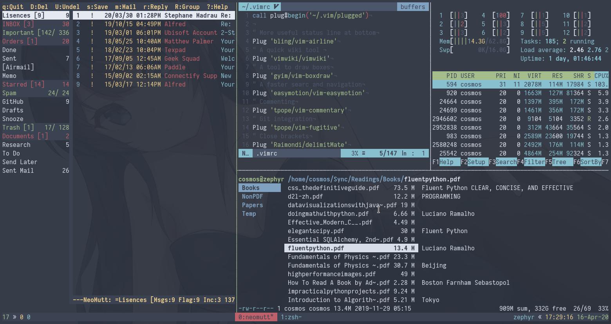
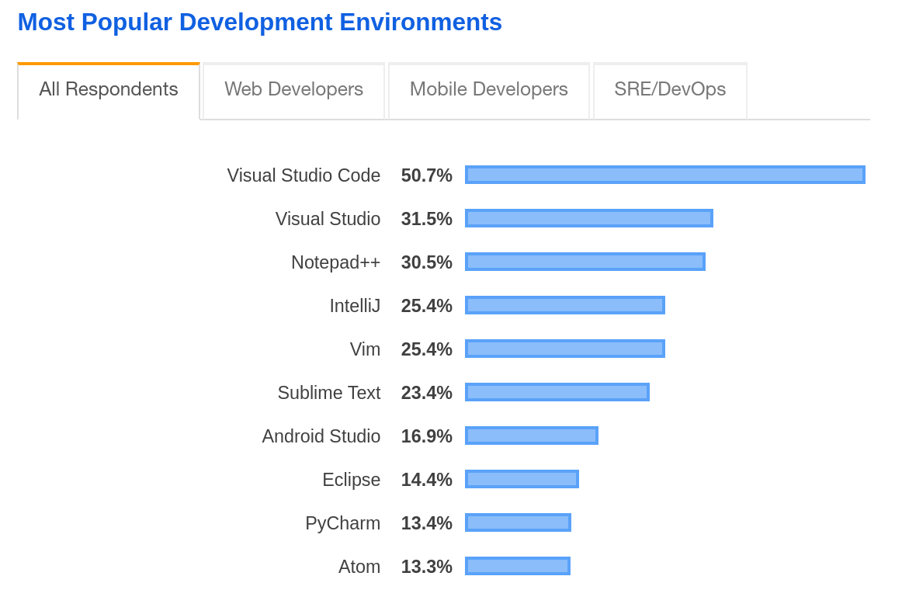
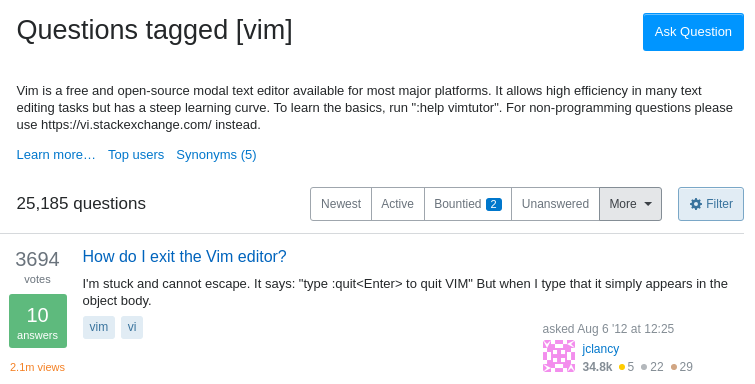
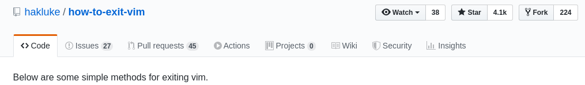
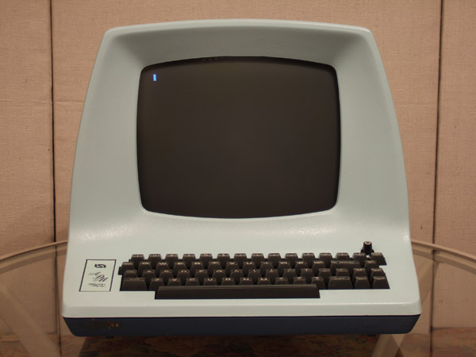

## Overview

- CLI tools
- Tmux
- Vim
- Demos!

## CLI vs GUI

- CLI (Command Line Interface)

- GUI (Graphical User Interface)

## What is Tmux

Tmux is a terminal multiplexer. 

A terminal multiplexer allow users to create multiple terminals within the same terminal. It also provides detach/attach functionalities to allow separating processes from a specific terminal. 

## Tmux introduction

Left is neomutt (e-mail client), top middle is vim (text editor, more on it later), top right is htop (system monitor), bottom left is ranger (file manager)

## How Tmux works

Session

- Window

  - Pane

Movement

- Moving between panes
- Moving between windows
- Switching sessions

## Detaching and reattaching

Why do we need tmux when we can just open multiple terminals?

### Separates the processes with the shell/terminal

# Vim 

## Vim

#### Vim (Vi IMproved) is a *modal* terminal based text editor. 

- It is one of the two editors that was in the editor holy wars (vim vs emacs)
- Its movement keys has been adopted by many applications

## Popularity of Vim at the moment

## Meanwhile on Stack Overflow

## Meanwhile on GitHub

## In case you're not aware yet

Ways to quit vim

- :q (quit)
- :wq (save and quit)
- :x (same as :wq)
- ZZ (same as :wq)
- Ctrl + W then q (same as :q)

## Why vim when there are other more morden editors?

Programmers has been arguing about vim vs other editors

- In the 90s, UltraEdit vs vim
- Then, Eclipse vs vim
- Then, TextMate vs vim
- Then, Sublime Text vs vim
- Then, Atom vs vim
- Now VS Code vs vim

There is only one other editor *emacs* which is aways there

## Why Vim

- How you use vim today will be how you use it 20 years from now. (proven by users since the 90s)

- Don't need to learn a new set of editor commands whenever your development environment changes

## Basics of Vim

### Vim is *modal*

Three modes

- [Normal]
- [Insert]
- [Visual]

## Vim motion

Moving left, down, up, right

- h, j, k, l

## ADM-3A computer terminal 

## Arrow keys on ADM-3A computer terminal

## Vim Motion continued...

Word motion

- "w" go forward word
- "b" go back one word

## Search

Global search

- "/" ("?")
- Regrex matching

Inline search

- f (F), t (T)
- Repeat with ";" and ","

## Basic Actions

- "y" Yank (Copy)
- "p" Put (Paste)
- "d" Delete
- "c" Change

## Basic Actions continued
Undo/Redo

- `u` (undo)
- `Ctrl + r` (redo)

Timetravel

- :earlier [time]
- :later [time]

## Combine action with motion

Example 

- `d2w` will delete the following two words

- `c5j` will delete the next 5 lines and enter [Insert]

## Vim Text Objects

Text Objects in Vim

- word (w)
- sentence (s)
- quotes (`"`, `'`)
- paragraph 
- brackets ("()", "[]", "{}")
- tags (`<head> </head>`, etc)

## Apply actions on text objects

Describing a text object

- `i[text object]` (inner text object)
- `a[text object]` (a text object)

Adding motion to actions on text objects

- `di"` Delete all text in quotes
- `cap` Change a paragraph

## Extending uppon motions, actions and text objects

- vim-commentary (add `gc` as action to comment/uncomment code)
- vim-surround ( add `S`, `cs` as actions to modify surroundings of text )

## How real programmers code

# Thank you!
