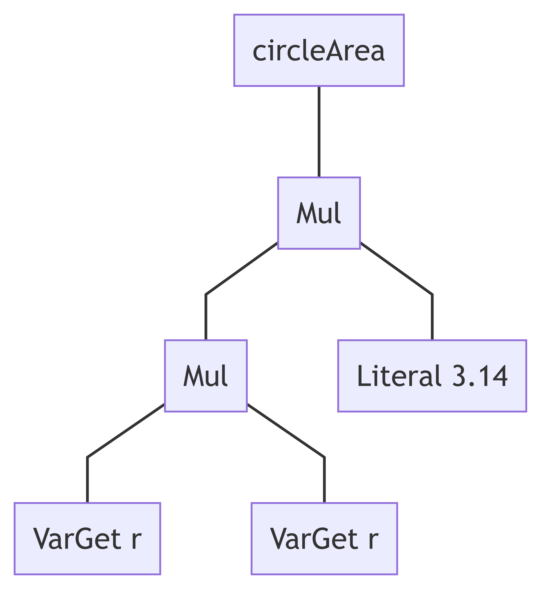

---
author:
- Wenhan Zhu (Cosmos)
title: Guide to exploring the SStuBs dataset
institute: University of Waterloo
linkstyle: bold
header-includes:
 - \usepackage[overlay,absolute]{textpos}
 - \usepackage{fvextra}
 - \DefineVerbatimEnvironment{Highlighting}{Verbatim}{breaklines,commandchars=\\\{\}}
---

## Single statement bugs (**_S_**imple **_St_**upid **_B_**ug**_s_**)

Source:

- top 100 Java Maven Projects
  - SStuBs: 10,231
  - Bugs: 25,539
- top 1000 Java Projects
  - SStuBs: 63,923
  - Bugs: 153,698

## Lots of effort in bug fixing by developers

![Ratio of total project effort spent on bug fixing by developers.[^1]](Ratio-of-total-project-effort-spent-on-bug-fixing-by-developers.png){height=500px}

[^1]: Software Quality Assurance During Implementation: Results of a Survey in Software Houses from Germany, Austria and Switzerland ICSQ 17

## For auto program repair

![Basic process of automated program repair(APR) [^2]](./program-repair.jpg){height=500px}

[^2]: LSRepair: Live Search of Fix Ingredients for Automated Program Repair APSEC 18

## Existing dataset size

: Stats on selected datasets for APR[^3]

| Name          | Domain     | Size            |
|---------------|------------|----------------:|
| DroixBench    | Android    | 24              |
| Codeflaws     | C/C++      | 3,902           |
| BugsJS        | JavaScript | 453             |
| QuixBugs      | Multiple   | 40              |
| Refactory     | Python     | 1,783           |
| **_SStubBs_** | **_Java_** | **_10k+/10k+_** |

[^3]: https://program-repair.org/benchmarks.html

## The creation of the dataset


## SZZ algorithm

![Initial publication of the SZZ algorithm at MSR 05'[^4]](./SZZ-paper.png)

[^4]: For reference the initial release of Git was in Apr. 07, 2005

##


1. We start with a bug report in the bug database, indicating a *fixed problem*.
2. We extract the associated change from the version archive, thus giving us the *location* of the fix.
3. We determine the *earlier change* at this location that was applied before the bug was reported

## `git blame`

![Example with `git blame`[^5]](./gblame.png)

[^5]: https://github.com/clojure/clojure/blob/master/src/clj/clojure/core.clj at commit 0df3d8e2e27fb06fa53398754cac2be4878b12d1

## SStuBs and general bugs


## Example pattern matched

Change Numeric Literal: `3.14` to `3.1415926`

::: columns

:::: column

{height=650px}

```java
circleArea = r*r*3.14
```

::::

:::: column

{height=650px}

```java
circleArea = r*r*3.1415926
```

::::

:::

# An example exploration: Commit pattern and bug fix authorship

## Tasks


## Immediate catches in SStuBs dataset

- `b3log/solo` migrated to `88250/solo` 
- `dropwizard/metrics` have "ghost" commits


## Going beyond the "naive" SZZ algorithm

Integration (e.g., C6) vs Implementation (e.g., C4)


## Incorrect localization of Bug Fix Line number

```java
final int oldLineNum = ((CompilationUnit) oldNode.getRoot()).getLineNumber( oldNodeStartChar );
```

![Bug report on Eclipse[^6]](./error-line.png)

[^6]: https://bugs.eclipse.org/bugs/show_bug.cgi?id=565639

## Determine commit attributes

- Authorship 
- Commit size (i.e., Churn)
- Bug fixing time

## Commit authorship

\small

```{.diff caption="Head of a Git commit"}
commit 1458db8e86332e0534e64869d452886472031633
Author:     Wenhan Zhu (Cosmos) <zhuwenhan950913@gmail.com>
AuthorDate: Thu Aug 20 00:46:30 2020 +0800
Commit:     Wenhan Zhu (Cosmos) <zhuwenhan950913@gmail.com>
CommitDate: Thu Aug 20 00:46:30 2020 +0800

    Update vim color settings for no numberline underscore and italic comments

diff --git a/vim/.vimrc b/vim/.vimrc
index d193be3..f8b8d8a 100644
```

\normalsize

## Commit change (Churn)

\small

```{.diff caption="Content of a Git commit"}
--- a/vim/.vimrc
+++ b/vim/.vimrc
@@ -442,5 +442,10 @@ nnoremap <silent> <space>p  :<C-u>CocListResume<CR>

-" Makes vim transparent
+" === Color settngs =====
+" Transparency
 hi Normal guibg=NONE ctermbg=NONE
+" No underline for current line number
+hi CursorLineNr cterm=bold gui=bold
+" Italic comments
+hi Comment cterm=italic gui=italic

```

$Churn = Added Lines + Removed Lines$

\normalsize


## Measuring fix time


Bug fix time: time difference between C1 and C6 (not C4)

## Developers often fix other peoples simple bugs

: Bug fixes by authorship

| Fixed by same author   | Fixed by a different author   | Total   |
| ---------------------: | ----------------------------: | ------: |
| 5,674                  | 4,508                         | 10,182  |

## Bug fix time


## Bug fix size


## Summary

\begin{textblock}{0}(0.2,3)
  \includegraphics[width=6.5cm,page=6]{presentation}
\end{textblock}
\begin{textblock}{0}(8.0,3)
  \includegraphics[width=6.5cm,page=8]{presentation}
\end{textblock}
\begin{textblock}{0}(0.2,9.3)
  \includegraphics[width=6.5cm,page=15]{presentation}
\end{textblock}
\begin{textblock}{0}(8.0,9.3)
  \includegraphics[width=6.5cm,page=19]{presentation}
\end{textblock}
