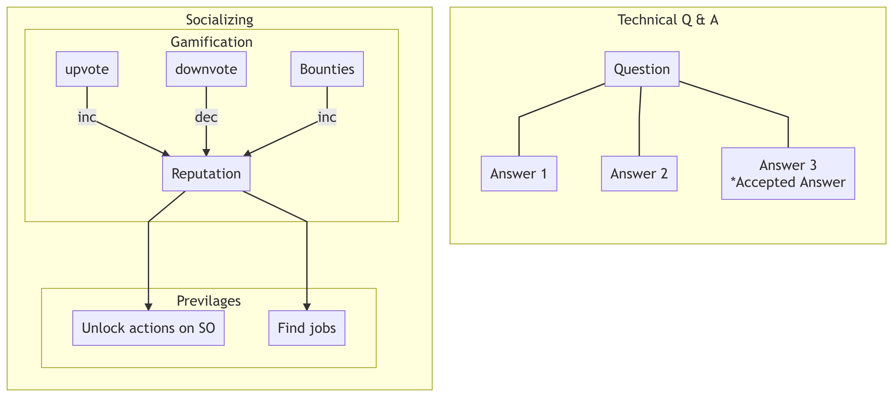
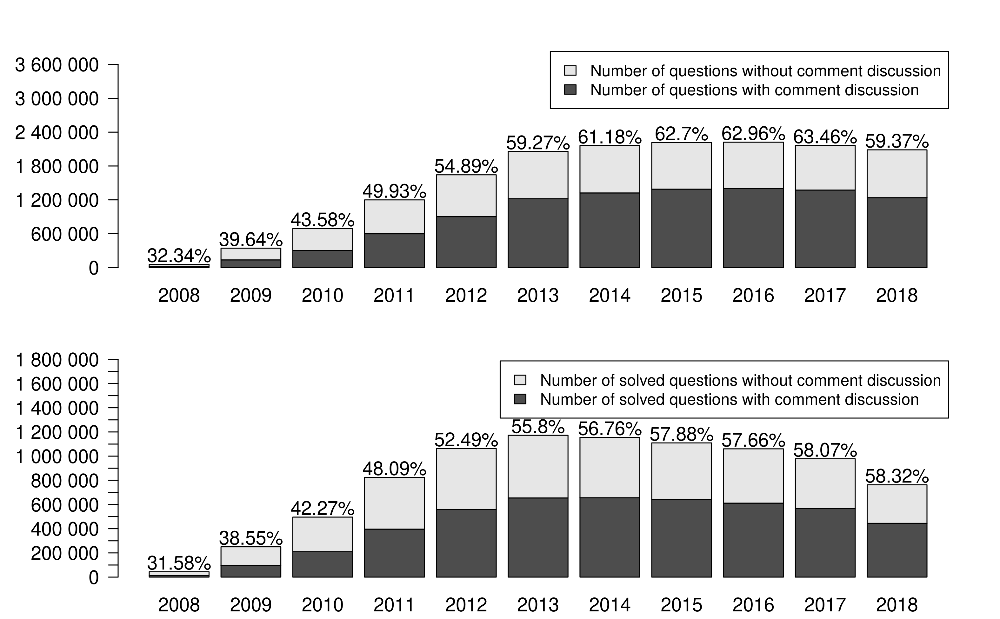
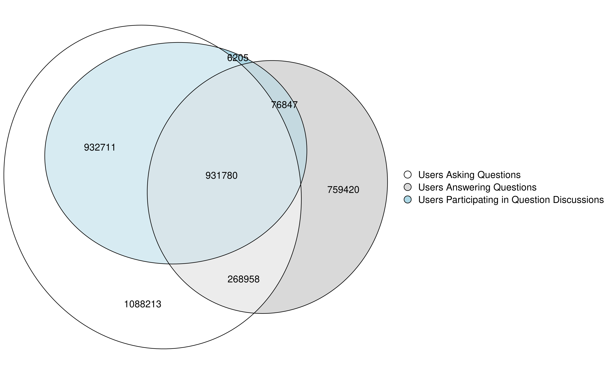
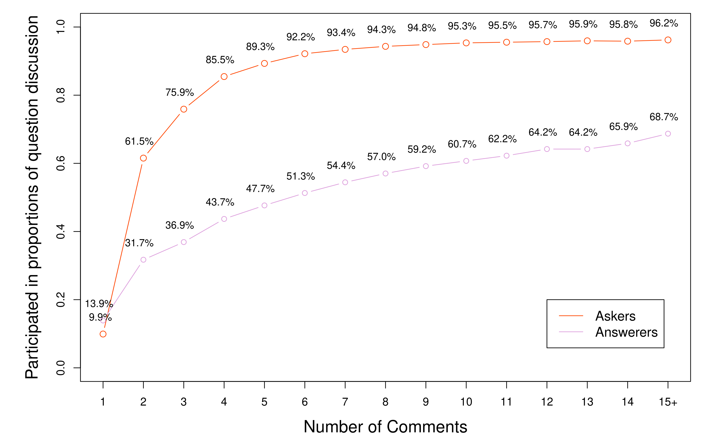
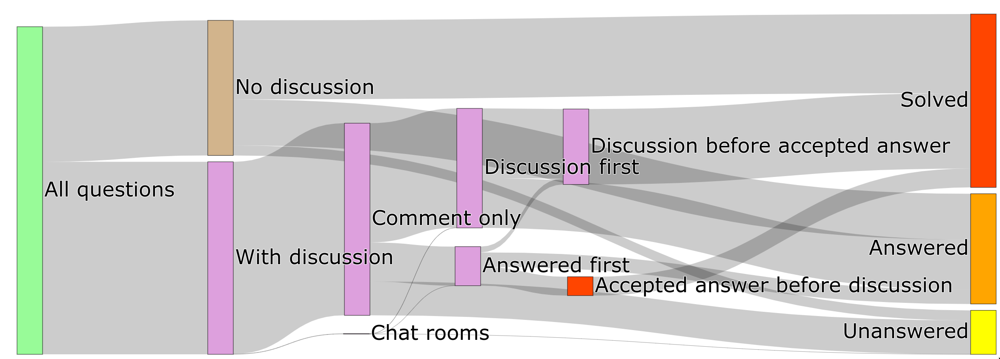
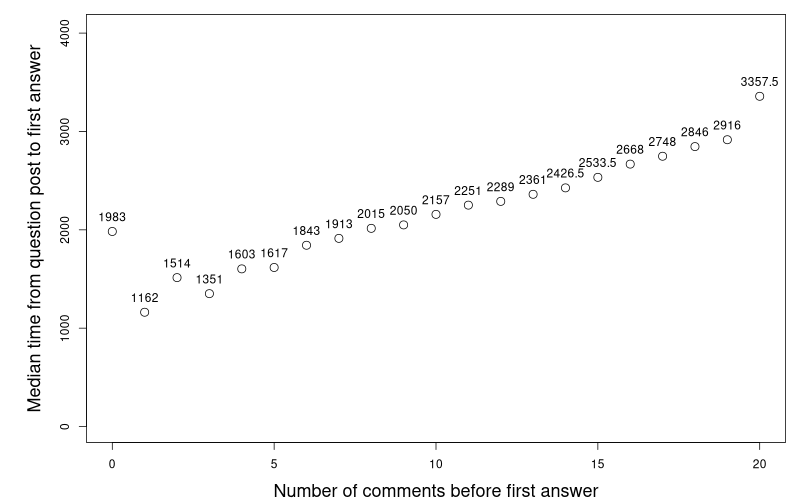
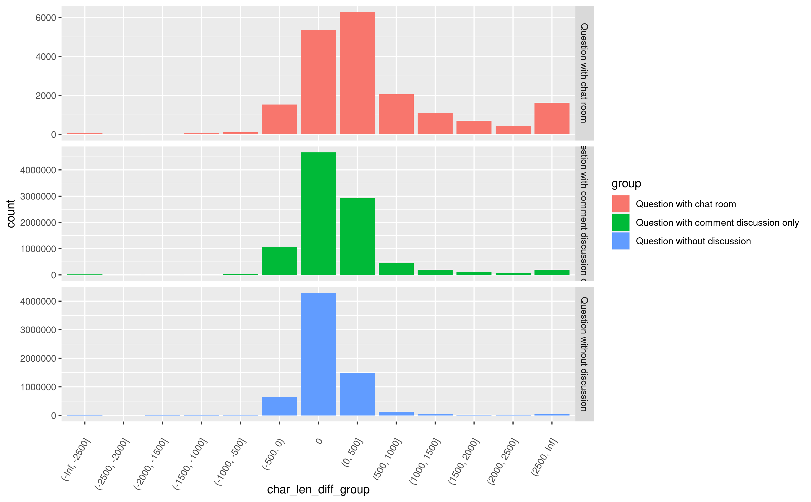

---
author:
- Wenhan Zhu (Cosmos)
title: An empirical study on discussions for Stack Overflow questions
institute: University of Waterloo
linkstyle: bold
header-includes:
 - \usepackage[overlay,absolute]{textpos}
 - \usepackage{fvextra}
 - \DefineVerbatimEnvironment{Highlighting}{Verbatim}{breaklines,commandchars=\\\{\}}
---

## Developer communication channels

![Communication channels over time[^Williams]](./communication-channels.png){height=750}

[^Williams]: 10.13140/RG.2.2.28208.61441

## Stack Overflow

::: columns

:::: column

{height=650px}

::::

:::: column

Copying and Pasting from Stack Overflow

--- by *Vinit Nayak*

::::

:::

## How Stack Overflow works

## Developers learn new technologies all the time

![Learning new tech frequency[^1]](./learn-new-tech-freq.png)

## Developers visit Stack Overflow when they get stuck

![What do you do when you get stuck[^1]](./action-when-stuck.png){height=650}

[^1]: [Stack Overflow Developer Survey 2020](https://insights.stackoverflow.com/survey/2020#developer-profile)

## Questions and answers may not be as isolated as it seems

{height=650}

## Discussion mechanics

![Example question flow[^2]](./example-question.png)

[^2]: [Unable to set the NumberFormat property of the Range class](https://stackoverflow.com/questions/10801537/unable-to-set-the-numberformat-property-of-the-range-class)

## Question discussions are gaining more popularity overtime but plateauing in recent years

{height=750}

## Active users on Stack Overflow participate in question discussions

{height=750px}

## Askers and answerers participate in high proportion of question discussions

{height=750}

## Question discussions occur during all phases of Q&A

{height=750}

## Questions with a small amount of discussion in comments receives answers faster

{height=750}

## Questions with extended discussions receives more editing

{height=750}

## GitHub introducing discussions

![New discussions section introduced on GitHub [^github]](./github-discussions.png){height=650}

[^github]: https://github.blog/2020-12-08-new-from-universe-2020-dark-mode-github-sponsors-for-companies-and-more/

## Summary

<!-- ref: https://tex.stackexchange.com/questions/420319/beamer-reuse-slides-from-same-presentation-for-summary-slide -->

\begin{textblock}{0}(0.2,3)
  \includegraphics[width=6.5cm,page=4]{presentation}
\end{textblock}
\begin{textblock}{0}(8.0,3)
  \includegraphics[width=6.5cm,page=8]{presentation}
\end{textblock}
\begin{textblock}{0}(0.2,9.3)
  \includegraphics[width=6.5cm,page=12]{presentation}
\end{textblock}
\begin{textblock}{0}(8.0,9.3)
  \includegraphics[width=6.5cm,page=15]{presentation}
\end{textblock}
