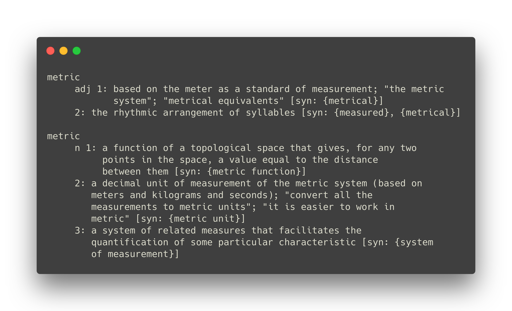

class: center,middle

## Actionable metrics are better metrics 
## + Evaluating complexity, code churn, and developer activity metrics as indicators of software vulnerabilities

### Presentation By Wenhan Zhu (Cosmos)

---
class: center, middle
## Metric

.footnote[Source: WordNet]

---
.left-column[
## Metrics
]
.right-column[

### Does it matter?

]

???
Used to determine conclusions of data.

Different metrics can leads to very different results.

---
.left-column[
## Metrics
]
.right-column[

### Does it matter?

### Consider the following statement

In a triangle, the three interior angles always add to $180^\circ$

]

---

.left-column[
## Metrics
]
.right-column[

### Does it matter?

### Consider the following statement

In a triangle, the three interior angles always add to $180^\circ$

Well... It's only true if we have the following metric tensor and distance function.

$$(ds)^2 = (dx)^2 + (dy)^2$$
$$ d((x_1, y_1), (x_2, y_2)) = \sqrt{(x_1 - x_2)^2 + (y_1 - y_2)^2}$$

]

---

.left-column[
## Metrics
]
.right-column[

### Does it matter?

### Consider the following statement

In a triangle, the three interior angles always add to $180^\circ$

However, it's not **ALWAYS** true.

]

???

Geodesic, the straight line of euclidean space.

---

## Poincaré half-plane

In the upper half plane of $\mathbb{R}$ defined as $H\\{(x,y)| y>0; x,y \in \mathbb{R}\\}$

With the following metric tensor.

$$(ds)^2 = \frac{(dx)^2 + (dy)^2}{y^2}$$

which means a distance function of $(x_1, y_1)$ and $(x_2, y_2)$

$$2 \ln {\frac{\sqrt{(x_2-x_1)^2 + (y_2-y_1)^2}+\sqrt{(x_2-x_1)^2 + (y_2+y_1)^2}}{2\sqrt{y_1y_2}}}$$

---
class:center,middle

.footnote[Source: Wikipedia]

---
.left-column[
## Metrics
]
.right-column[
Two types of metrics in SE

- Actionable Metrics

- Emergent Metrics
]

---
.left-column[
## Metrics
]
.right-column[

## Emergent Metrics

Metrics that provides overall assessment of the data but can't be relied upon to diagnose the problem.

Examples:

- Number of Bugs

- Code Churn

]

---

.left-column[
## Metrics
]
.right-column[

## Actionable Metrics

Metrics that measures a property directly under a developer's control.

Examples:

- Number of developers working on a file

- Number of method callees

- Number of parameters

]

---

.left-column[
## CCD
]
.right-column[
#### CCD Metrics as Indicators of Software Vulnerabilities

CCD:

- Complexity

- Code Churn

- Developer Activity
]

???
Paper

---

.left-column[
## CCD
]
.right-column[
## Complexity

- IntraComplexity
  - Line of Code (LOC)
  - Number of functions defined in a file
  - \# LOC devoted to declarations
  - \# LOC devoted to preprocessing
  - Sum of essential complexity
  - Sum/Max of strict cyclomatic complexity
  - Sum/Max of max nesting level of control constructs

- Coupling
  - Sum/Max of inputs to a function
  - Sum/Max of assignments to the parameters to call

- Comments
  - Ratio of comments to code

]

???
**Essential Complexity** Number of branches after reducing all programming primitives in a function's control flow graph into a nod iteratively until the graph cannot be reduced any further. Completely well-structured code has essential complexity 1.

**Cyclomatic Strict Complexity** Nomber of conditional statements in a function.

---
.left-column[
## CCD
]
.right-column[
## Code Churn

In general means the measure of the rate code evolves.

- \# of check-ins for a file since creation
- Cumulated number of code lines changed since creation
- Cumulated number of new code lines since creation
]

???
check-ins into the version control system

---
.left-column[
## CCD
]
.right-column[
## Developer Activity

### Developer Network

Consider each developer as a node in a graph.

When 2 developers worked on the same file, there's an edge between the two developers.

]

---
.left-column[
## Developer Activity
]
.right-column[
## Centrality
- degree: number of neighbours of a node
- closeness: average distance from a node $v$ to any other node that it can reach
- between: number of geodesic paths that include $v$

]
???
Geodesic path: shortest path from a node $u$ to $v$, need not to be unique.

---
.left-column[
## Developer Activity
]
.right-column[
#### Cluster

A set of nodes such that there are more edges within a set than edges between a set and other set of nodes

#### Edge Betweeness

Number of geodesic path though a edge

]

---
.left-column[
## Developer Activity
]
.right-column[
### Contribution Network

Bipartite graph with files and developers as nodes. 

If a developer edited a file, there is an edge between them.

]

---
.left-column[
## CCD
]
.right-column[
## Developer Activity

- Centrality
  - Min/Avg degree
  - Max/Avg closeness
  - Min/Avg betweeness

- Cluster
  - Max/Avg Edge Betweeness

- Contribution Centrality
  - \# Devs
  - Contribution Network Closeness

]

???
**CNCloseness** file was changed by developers who focused on many other files.

---
.left-column[
## Metrics
]
.right-column[

## Metrics to measure

TP, TN, FP, FN

- Probability of Detection (PD)
  
  $$ PD = TP/(TP + FN) $$

- Probability of False alarm (PF)

  $$ PF = FP/(FP + TN) $$

- Precision (P) 

  $$ P = TP/(TP + FP) $$

]

---

## Metrics to measure continued

- File Inspection (FI)

  $$ FI = (TP + FP)/(TP + TN + FP + FN) $$

- LOC Inspection (LI)

  $$ LI = (TP\_{LOC} + FP\_{LOC}) / (TP\_{LOC} + TN\_{LOC} + FP\_{LOC} + FN\_{LOC}) $$

- File Inspection Reduction (FIR)

$$ FIR = (PD - FI) / PD $$

- LOC Inspection Reduction (LIR)

$$ LIR = (PV - LI) / PV $$

- Predicted Vulnerability (PV)

$$ PV = TP\_{Vuln} / (TP\_{Vuln} + FN\_{Vuln}) $$

???
Distinction mainly due to one focuses on files other focuses on vulnerabilities (more than 1 vulnerabilities in 1 file).

---
.left-column[
## Prediction
]
.right-column[

## Experiments

Data is skewed and only a extremely small percentage (<1.5%) have vulnerabilities.

Undersampling was used. 

## Case studies

- Firefox

  Merge 3 version for the following version

- RHEL 4

  Used bug reports from Red Hat and actual code from Linux kernel

]

---
.left-column[
## Firefox
]
.right-column[

]

---
class:center
## Results & Conclusions

---
.left-column[
## Summary
]
.right-column[
## Hightlights

- Most metrics work 24/28 for both

- *CountLinePreprocessor* and *CommentDensity* were not discriminative between neutral and vulnerable files

- *DNMinDegree* negatively correlated with vulnerability while *DNAvgDegree* positively correlated in both.

- *DNAvgBetweenness* disagrees with hypothesis and unable to find clear reason.

- Precision was low

]

???
**Precision**: although mean was different, normal files cover the range of vulnerable files

**Min, Avg** files are more likely to be vulnerable if they are changed by developers who work on many other files. But when all the developers work on this file are central, it's less likely to be vulnerable.

---

.left-column[
## Discussion
]
.right-column[

- Vulnerability vs Fault?

- What are some questionable metrics you've seen in real life?

- Almost a decade after the publication of this paper, have we improved on the metrics we use in SE?
]

---

class: center, middle

#Thank you!

.footnote[Slides powered by [Remark](https://remarkjs.com/#1)]

