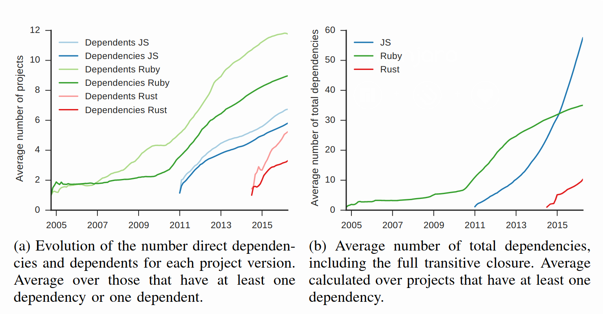

class: center,middle

# Dependency Evolution Analysis on Arch Repositories

### By Wenhan Zhu (Cosmos)

---
.left-column[
    ## Motivation
]
.right-column[
### Related work

Previous work done on dependency network analysis for NPM, Cargo, Gem [1]


Installability analysis base on dependency for Debian, OPAM, CRAN [2]

Work done on dependency network analysis of PyPI, CRAN, NPM show that each ecosystem are not generalizable [3]


# Why Arch?

]

---
.left-column[
    ## Arch Linux
]

.right-column[
- Dependency Network evolution

- Installability Issues

| | Monitored | Maintained|
| - | - | - | 
| Language | NPM, PyPI, Gem, Drupal, CRAN | OPAM
| Distribution | **Arch User Repository (AUR)** | Debian 

For all large scale distributions, Arch has the only monitored repository (AUR).
]

???
2 type of package manager


**Monitored**: Any user could submit a package, community maintainter will only take action on special circumstances

**Maintained**: A package could not be submitted and/or updated until reviewed by community maintainers.

---
.left-column[
    ## Terminology
]
.right-column[
#### Software repository
A software repository, colloquially known as a "repo" for short, is a storage location from which software packages may be retrieved and installed on a computer.[Wiki]

#### Dependency
```
A --> B --> C
```
If A depends on B and B depends on C.

- B is a dependency for A

- A is a dependent of B

- C is a transitive dependency for A

- A is a transitive dependent for C

]

---
.left-column[
## Arch Repositories
]
.right-column[
### Official

2 separate SVN repositories that holds all packages in each. Have a git mirror.

- Core and Extra (Refer as Core from now on)

- Community

### Unofficial

Each package hosted on separate Git repos.

- Arch User Repository (AUR)
]
???
**Core** Holds essential packages for Arch Linux and the software that needs to build them, **Extra** for those important but does not classify as core such as x.org, python.

**Community** Holds popular packages from community. 

**Migration** If a package is popular in AUR and fits will be moved to community then in special cases moved to core.

---
.left-column[
## Arch Repository Structure

### Official
```
file
|__repos
|  |__architecture
|      |__PKGBUILD
|__trunk
   |__PKGBUILD
```

### AUR
Each git repo
```
file
|__PKGBUILD
|__.SRCINFO

```
]
.right-column[
### Port-like System
Build script that contains every information to build the software.

**PKGBUILD**: is a shell script containing the build information required by Arch Linux packages.

### Metadata for *PKGBUILD*
*.SRCINFO* extracted from *PKGBUILD*


### Structure of official
`repos/architecture/PKGBUILD` contains the code that builds the binary.

`trunk/PKGBUILD` is for development space.

]

???
Shell script could contain Malicious code.

Should always inspect, including AUR.

Arch officially only support x86-64

---
.left-column[
## Examples
]
### *PKGBUILD*
```
pkgname=glibc
pkgver=2.26
pkgrel=4
pkgdesc='GNU C Library'
arch=(i686 x86_64)
url='http://www.gnu.org/software/libc'
depends=('linux-api-headers>=4.10' tzdata filesystem)
makedepends=(git gd)
optdepends=('gd: for memusagestat')
...

.right-column[
```
### *.SRCINFO*
```
pkgbase = glibc
	pkgdesc = GNU C Library
	pkgver = 2.26
	pkgrel = 4
	arch = x86_64
	makedepends = git
	makedepends = gd
	depends = linux-api-headers>=4.10
	depends = tzdata
	depends = filesystem
	optdepends = gd: for memusagestat
	options = !strip
	options = staticlibs
...
pkgname = glibc

```
]
???
*pkgbase* meta information of single PKGBUILD file

Only *pkgname* is a package, defaults to *pkgbase* value.

---
.left-column[
## Cloning
]
.right-column[
### Official

Clone the git mirror of svn repositories. 

First commit:

- Core: 2008 Apr. 6

- Community: 2009 Jul. 16

### AUR
AUR hosts a list of all currently available packages. Used a tool `auracle` to clone each repo.

4000 API limits per IP per day

#### Problem

- Correctness of Tool

- No way of getting deleted packages


]
???

Reason for tool, package name does not neccesary match git repo name. Need to query AUR to get information about git repository.


AUR log contain information of deleted git repo package base name. Git url could be valid but not guaranteed.


AUR updated to current as of middle of 2015 used to be same as official. Every package was resubmitted. Archive of previous on github.

---
.left-column[
## Extract *.SRCINFO*
]
.right-column[
## Official
Does not contain *.SRCINFO* file. Created VM to run command to extract *.SRCINFO*.

Packages that does not generate *.SRCINFO* file or does not follow standard file structure are ignored. 

## AUR
Parse *.SRCINFO* file given. 

## Validation of parsed results
Compare with Arch official website
Followed Arch wiki for standard
]

???
**.SRCINFO** errors in official are sometime inconsistend with arch official website. However, followed arch wiki for guidelines as standard.

---
.left-column[
## Analysis
]
.right-column[
## Snapshots
Took snapshots by 3 months from 2016 Mar. to 2018 Sept.

## Dependency
Compute as directed graph. 

- \# of depends: Size of child of each node

- \# of transitive depends: Size of transitive enclosure of each node
]
---
.left-column[
## Analysis
]
.right-column[
### Installability

- Dependency conflict

    ```
    A -> B.ver == 1
    A -> C
    C -> B.ver == 2
    ```

- Dependency cycle

- Dependency missing

    ```
    A -> B

    B not in repository
    ```

Dependency cycle could happen in arch official repositories!

### Example
Cycle of dependency
```
freetype2 <--> harfbuzz
```


]

???

Will only focus on missing dependency

Reallife reason and solution. Compile X with Y disabled then compile Y with X then compile X again with Y. (gcc)

---
.left-column[
## Results
]
.right-column[

]
---
.left-column[
## Results
]
.right-column[

]
---
.left-column[
## Results
]
.right-column[

]
---
.left-column[
## Comparison
]
.right-column[

]
---
.left-column[
## Results
]
.right-column[

]
---
.left-column[
## Results
]
.right-column[

]
???
Mean is 0 for all

Mean for core is 2 (dir) 3~5 (trans) *not increasing*
---
.left-column[
## Results
]
.right-column[

]
---
.left-column[
## Results
]
.right-column[

]
???
Basically 0 for core packages

---
.left-column[
## Results
]
.right-column[

]

---
.left-column[
    ## References
]
.right-column[
[1] Structure and evolution of package dependency networks. *Riivo Kikas, Georgios Gousios Marlon Dumas Dietmar Pfahl*. MSR '17

[2] Mining component repositories for installability issues. *Pietro Abate, Roberto Di Cosmo, Louis Gesbert, Fabrice Le Fessant, Ralf Treinen, Stefano Zacchiroli*. MSR '15

[3] On the topology of package dependency networks: A comparison of three programming language ecosystems. *A. Decan, T.mens, M. Claes*. ECSAW 2016
]
---

class: center, middle

#Thank you!

.footnote[Slides powered by [Remark](https://remarkjs.com/#1)]

