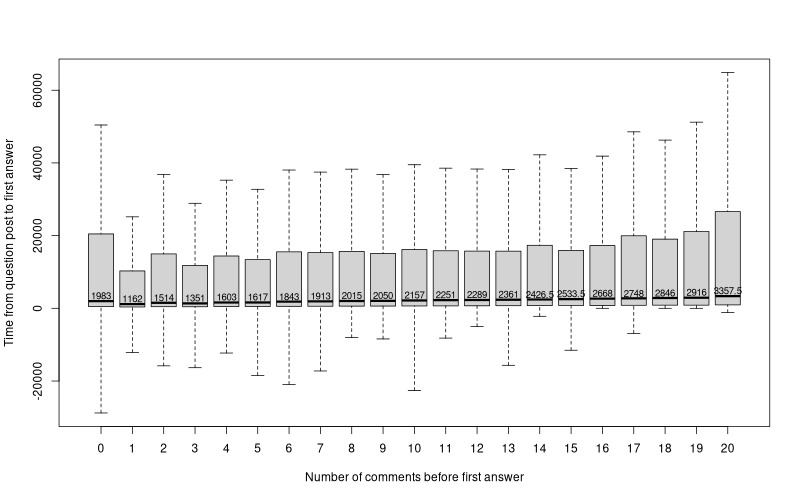
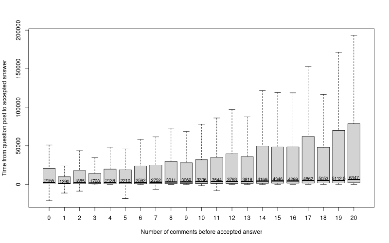

## Research Questions

> **to do** update after fixing storyline

1. How prevalent are question chatted on Stack Overflow?
1. How do discussions migrate from commenting to chatting?
1. How does chatting affect question answering activities?

## RQ1: Do discussions helps with answering questions on Stack Overflow?

- Discussion is prevalent in all phases of answering activities (from before
  answer to after accepted answer)
- Discussion is used by answerers for answering activities (Answerer's appearance in
  discussion)
- Questions with small amount of discussions receives answers (accepted answers)
  faster.

**Discussions are prevalent on Stack Overflow and they are an essential part of
the answering process**

## RQ1R1: When do discussion happen relative to answering activities?

Discussion in comments exist in all phases of question answering activities on
Stack Overflow. For answered (solved) questions, when discussions exist, they
start before the answer (accepted answer).

: When do discussions exist relative to receiving first answer

| Questions with discussion and answers    |         8,155,998 |
|------------------------------------------|------------------:|
| Discussion start before the first answer | 6,146,272 (75.4%) |
| Discussion end before first answer       | 3,574,178 (43.8%) |

## Continued...

: When do discussions exist relative to receiving the accepted answer

| Questions with discussion and the accepted answer |         4,851,291 |
|---------------------------------------------------|------------------:|
| Discussion start before the accepted answer       | 3,881,225 (80.0%) |
| Discussion end before the accepted answer         | 2,454,997 (50.6%) |
| Discussion end after the accepted answer          | 2,393,896 (49.3%) |
| Discussion start before the accepted answer       |   967,182 (19.9%) |

## Discussions for questions are prevalent in all phases of question answering.

Most discussions start before questions receive answers. About half of
discussions ends before receiving answers while others continue after the
question receives answers. Even after a question receives the accepted answer,
discussion could happen.

WZ: to explore: same analysis for $Question_{WithChat}$

## RQ1R2: Do answerers participate in discussions for questions?

: Answerer participation in comment discussion

|                                                               |       In comments |  In chat rooms |
|---------------------------------------------------------------|------------------:|---------------:|
| Questions with discussion and answers                         |         8,155,998 |         15,016 |
| Questions with answerer in comments                           | 2,764,753 (33.9%) | 10,748 (71.6%) |
| Questions with answerer in comments before posting the answer | 2,157,828 (26.5%) |  8,136 (52.5%) |

## RQ1R2: continued...

: The accepted answerer participation in comment discussion

|                                                                              |       In comments | In chat rooms |
|------------------------------------------------------------------------------|------------------:|--------------:|
| Questions with the accepted answer                                           |         4,851,291 |        10,021 |
| Questions with the accepted answerer in discussion                           | 1,466,064 (30.2%) | 7,943 (79.3%) |
| Questions with the accepted answerer in discussion before posting the answer | 1,170,202 (24.1%) | 6,080 (60.7%) |

## RQ1R2: continued...

**This observation suggests that users posting answers also participate in
discussions.** Users also participate in discussions after they post answers,
even the later accepted answers. It supports our conjecture that discussions
facilitate the answering process and is essential to question answering
activities. 

**In $Question_{WithChat}$ a higher percentage of questions are answered (both
any answer and the accepted answer) by users participating in chat.** The higher
percentage compared to comments suggests that users are more involved with the
question when they participate in chat. They show a stronger will to help the
asker and provide answers especially accepted answers.

## RQ1R3: Do discussions speed up question answering?

## Continued...

**Questions with a small amount of discussion receive answers faster than
questions with no discussion.** When discussions for questions exist, the time
to receive answers increases as the amount of discussion increases. When
questions have less than 8 comments, they receive answers faster than questions
with no comments. This finding could imply that small amounts of discussion is
beneficial to questions and decreases the amount of time for receiving answers.

## Continued...

The same trend exists for accepted answers. However, when the discussion reaches
5 comments, questions with discussions require longer time to receive their
accepted answer.-

## For $Question_{WithChat}$

Questions with chat rooms takes much longer to answer compared to most
questions.

First answer: median 5493.5 secs

Accepted answer: median 7892 secs

## RQ2: How do users leverage the commenting and chatting communication channels?

- While discussion is prevalent, most discussion for Stack Overflow questions is
  done through commenting.
- Despite the option to chat is available to many users, only few created the
  chat room.
- Most users move the discussion completely into chat rooms after its creation,
  few comment and chat at the same time.

## RQ2R1: How much discussion happen in the two communication channels?

Commenting is the dominating communication channel with 33.5 million comments
associated with 9,900,628 questions on Stack Overflow.

While only 19,527 questions have chat rooms, these chat rooms generate more than
1 million messages.

## RQ2R2: Do users opt to use the chat room when its available?

Despite 408,248 questions have triggered the option to create a chat room, in
91.3% (i.e., 372,532) of the questions, a chat room was not created. 

## RQ2R3: Where do users discuss when both communication channels are available?

Discussions in 68.5% (i.e., 13,372) of $Question_{WithChat}$ move completely into the chat room
after its creation.

When both communication channels are available, in 17.4% (i.e., 3,401) of
$Question_{WithChat}$ users make use of both communication channels at the same
time. $\leftarrow$ WZ: this number is upper bound, could be affected by the
switching pain.

## RQ3: How do chatting and commenting differ?

**Incomplete** 

- Chatting provides a more interactive communication channel compared to
  commenting (commenting takes a factor of 5.2 longer than chatting to receive
  replies)
- WZ: to explore: ave char length $\rightarrow$ push for communication style
  difference
- WZ: to explore: sentiment $\rightarrow$ push for a less strict chatting
  environment

## Highlights

- Discussions are essential in the answering process, answerers use it as a
  means to communicate with the asker through discussions.
- Of the two available methods, users use comments mone than chat. While chat is
  available, most users stick with chat.
- Chat offers a more interactive channel compared to comments.

## Extra RQ: How well does the chat room mechanism work on Stack Overflow?

- Do users accept the offer when triggered the option to create a chat room?
- How many chat rooms end up worth retaining?
- Can we find the sweet spot for offering the option to create a chat room so
  chat rooms won't be deleted?

WZ: I think this RQ suits better for the chat room empirical paper

